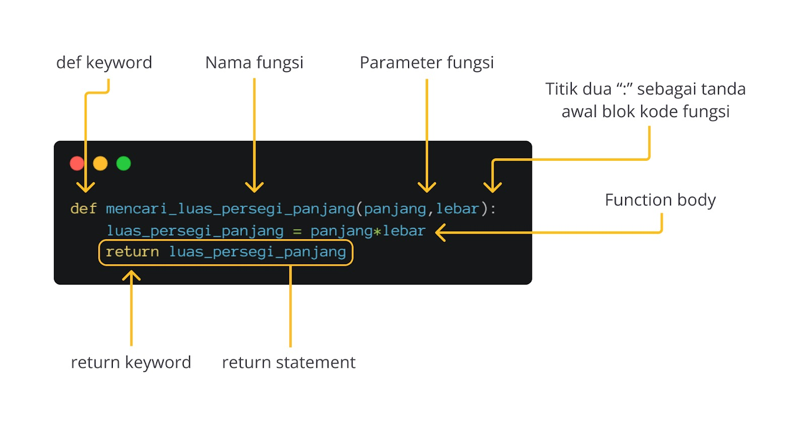
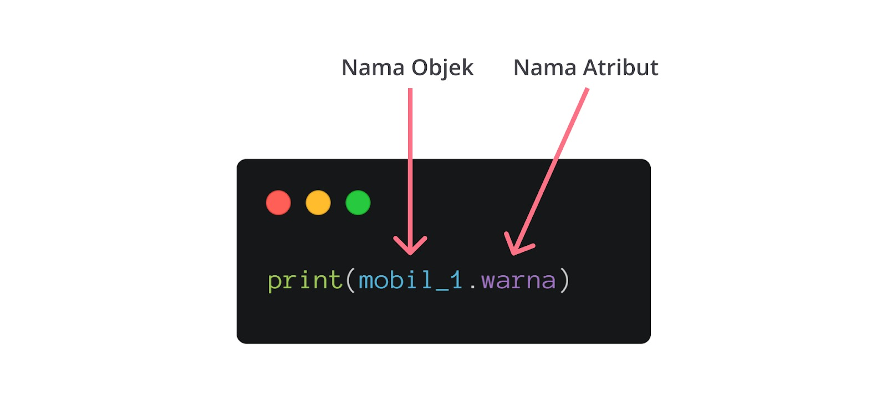

# 🐍 Python Programming

In this week we'll learn about Python programming. We'll start with the pre-test, then we'll learn about the introduction to Python, interact with data, expression, control flow, array and processing, matrix, subprogram, QnA, and post-test.

<!-- TOC -->

- [📚 Resources](#-resources)
- [🐍 Introduction to Python](#-introduction-to-python)
  - [Python Code Editor](#python-code-editor)
  - [Variables and Assignment](#variables-and-assignment)
  - [Input, Output, and Comment](#input-output-and-comment)
- [💥 Interact with Data](#-interact-with-data)
  - [Data Abstraction](#data-abstraction)
  - [Data Typing: Declaration and Initialization](#data-typing-declaration-and-initialization)
  - [Data Type: Primitive and Collection](#data-type-primitive-and-collection)
  - [Operation on List, Set and String](#operation-on-list-set-and-string)
- [🧐 Expression](#-expression)
  - [Type of Expression](#type-of-expression)
  - [Operator](#operator)
- [🎮 Control Flow](#-control-flow)
  - [Conditional Statement](#conditional-statement)
  - [Loop](#loop)
- [⚙️ Array and Processing](#️-array-and-processing)
  - [Array Fundamental](#array-fundamental)
  - [Sequential Processing](#sequential-processing)
- [⬜ Matrix](#-matrix)
  - [Operation on Matrix](#operation-on-matrix)
- [🔧 Subprogram](#-subprogram)
  - [Function](#function)
- [🧱 OOP (Object Oriented Programming)](#-oop-object-oriented-programming)
  - [Class and Object](#class-and-object)
  - [Inheritance](#inheritance)
  - [Polymorphism](#polymorphism)
  - [Encapsulation](#encapsulation)
  <!-- /TOC -->

## 📚 Resources

- [📑 Presentation](week%201%20-%20Pemrograman%20dengan%20Python.pdf)
- [🪶📖 Pre-test and Post-test](https://drive.google.com/file/d/1iE17S1aVfgjUedxBJiijeqsaco3i5MAg/view?usp=drive_link)

## 🐍 Introduction to Python

[](https://youtu.be/n67IK1aejyA)

### Python Code Editor

There's bunch of code editor that you can use to write Python code. Here's some of them:

- [Repl.it](https://repl.it/)
- [Jupyter Notebook](https://jupyter.org/)
- [Google Colab](https://colab.research.google.com/)
- [Visual Studio Code](https://code.visualstudio.com/)
- [PyCharm](https://www.jetbrains.com/pycharm/)
- [Sublime Text](https://www.sublimetext.com/)
- [Atom](https://atom.io/)

### Variables and Assignment

In Python, you can assign a value to a variable using the `=` operator. Here's an example:

```python
x = 5
y = 10
z = x + y
print(z)
```

### Input, Output, and Comment

You can use `input()` function to get input from user, and `print()` function to print output. You can also use `#` to write a comment.

```python
# This is a comment
name = input("What is your name? ")
print("Hello, " + name)
```

## 💥 Interact with Data

### Data Abstraction

Data abstraction is the process of hiding the implementation details and showing only the functionality to the user. Here's an example:

```python
class Car:
    def __init__(self, brand, year):
        self.brand = brand
        self.year = year

    def display(self):
        print(f"{self.brand} ({self.year})")

car = Car("Toyota", 2022)
car.display()
```

### Data Typing: Declaration and Initialization

In Python, you don't need to declare the data type of a variable. You can just initialize it directly.

```python
x = 5
y = "Hello"
z = 3.14
```

### Data Type: Primitive and Collection

In Python, there are two types of data types: primitive and non-primitive(`collection`). Primitive data types are the basic data types, while non-primitive data types are more complex.

Here's an example of primitive data types:

- Number (`int`, `float`, `complex`)
- String (`str`)(with single or double quotes `'` or `"`)
- Boolean (`bool`)

```python
x = 5
y = 3.14
z = "Hello"
```

And here's an example of non-primitive data types:

- List (`list`) which is ordered and changeable
- Tuple (`tuple`) which is ordered and unchangeable
- Set (`set`) which is unordered, unique and unindexed
- Dictionary (`dict`) which is unordered, changeable and indexed with `key: value` pair

```python
w = [1, 2, 3, 4, 5] # list
x = (1, 2, 3, 4, 5) # tuple
y = {1, 2, 3, 4, 5} # set
z = {"name": "John", "age": 30} # dictionary
```

### Operation on List, Set and String

You can perform various operations on list, set, and string. Such as len, min and max, and many more.

```python
# len
x = [1, 2, 3, 4, 5]
print(len(x)) # 5

# min and max
x = [1, 2, 3, 4, 5]
print(min(x)) # 1

# in and not in
x = [1, 2, 3, 4, 5]
print(1 in x) # True
print(6 not in x) # True

# unpacking, assign value to variable
x = [1, 2, 3, 4, 5]
a, b, c, d, e = x
print(a, b, c, d, e) # 1 2 3 4 5

# sort
x = [5, 3, 1, 4, 2]
x.sort()
print(x) # [1, 2, 3, 4, 5]
```

## 🧐 Expression

Expression is a combination of variables, operations and values that yields a result value. Here's an example:

```python
x = 5
y = 10
z = x + y
print(z) # 15
```

### Type of Expression

There are several types of expression in Python:

- Arithmetic expression
- Relational expression
- Logical expression

### Operator

There are several operators in Python:

- Arithmetic operator (`+`, `-`, `*`, `/`, `//`, `%`, `**`)
- Relational operator (`==`, `!=`, `>`, `<`, `>=`, `<=`)
- Logical operator (`and`, `or`, `not`)

## 🎮 Control Flow

### Conditional Statement

You can use `if` for 1 condition, `elif` for 2 condition, and `else` for 3 or more condition to create a conditional statement.

```python
x = 5
if x > 0:
    print("Positive")
elif x < 0:
    print("Negative")
else:
    print("Zero")
```

### Loop

You can use `for` loop to iterate over a sequence, `while` loop to execute a block of code as long as the condition is true, and `nested for` loop to iterate over a sequence of sequences.

```python
# for loop
for i in range(5):
    print(i)

# while loop
i = 0
while i < 5:
    print(i)
    i += 1

# nested for loop
for i in range(5):
    for j in range(5):
        print(i, j)
```

## ⚙️ Array and Processing

### Array Fundamental

Array is a collection of items stored at contiguous memory locations. It's a data structure that contains a group of elements. In Python, you can use list to create an array.

```python
x = [1, 2, 3, 4, 5]
print(x[0]) # 1
```

### Sequential Processing

Sequential processing is a type of processing that executes one task at a time. It's the simplest form of processing.

```python
x = [1, 2, 3, 4, 5]
for i in x:
    print(i)
```

## ⬜ Matrix

Matrix is a collection of numbers arranged into a fixed number of rows and columns. You can use list of list to create a matrix.

```python
x = [
    [1, 2, 3],
    [4, 5, 6],
    [7, 8, 9]
]
print(x[0][0]) # 1
```

### Operation on Matrix

You can perform various operations on matrix. Either on 1 matrix or 2 matrix.

- Operations of 1 Matrix.
  - Calculates the total of all matrix elements.
  - Multiplies matrix elements by a constant.
  - Transpose the matrix.
  - Inverse the matrix.
  - Determining the determinant, and so on.

```python
import numpy as np

class MatrixOperations:
    def __init__(self, matrix):
        self.matrix = matrix

    def calculate_total(self):
        return np.sum(self.matrix)

    def multiply_by_constant(self, constant):
        return self.matrix * constant

    def transpose(self):
        return np.transpose(self.matrix)

    def inverse(self):
        try:
            return np.linalg.inv(self.matrix)
        except np.linalg.LinAlgError:
            return "Matrix is not invertible"

    def determinant(self):
        return np.linalg.det(self.matrix)

# Example usage:
matrix = np.array([[1, 2, 3], [4, 5, 6], [7, 8, 9]])
matrix_ops = MatrixOperations(matrix)

print("Matrix Total:", matrix_ops.calculate_total())
print("Matrix multiplied by 2:\n", matrix_ops.multiply_by_constant(2))
print("Transposed Matrix:\n", matrix_ops.transpose())
print("Inverse of Matrix:\n", matrix_ops.inverse())
print("Determinant of Matrix:", matrix_ops.determinant())
```

- Operation of 2 Matrix:
  - Adding two matrix.
  - Multiplying two matrix.
  - Division of two matrix, and so on.

```python
import numpy as np

class MatrixOperations:
    def __init__(self, matrix1, matrix2):
        self.matrix1 = matrix1
        self.matrix2 = matrix2

    def add_matrices(self):
        return np.add(self.matrix1, self.matrix2)

    def multiply_matrices(self):
        return np.matmul(self.matrix1, self.matrix2)

    def divide_matrices(self):
        try:
            return np.linalg.solve(self.matrix2, self.matrix1)
        except np.linalg.LinAlgError:
            return "Cannot divide, matrix2 is singular"

# Example usage:
matrix1 = np.array([[1, 2], [3, 4]])
matrix2 = np.array([[5, 6], [7, 8]])
matrix_ops = MatrixOperations(matrix1, matrix2)

print("Sum of Matrices:\n", matrix_ops.add_matrices()) # [[6 8] [10 12]]
print("Product of Matrices:\n", matrix_ops.multiply_matrices()) # [[19 22] [43 50]]
print("Result of Matrix1 divided by Matrix2:\n", matrix_ops.divide_matrices()) # [[-4. 4.] [3.5 -3.5]]
```

## 🔧 Subprogram

Subprogram is a set of instructions designed to perform frequently used operations in a program. It's a self-contained module that can be called from anywhere in the program.

```python
def add(x, y):
    return x + y

def subtract(x, y):
    return x - y

def multiply(x, y):
    return x * y

def divide(x, y):
    return x / y

print(add(5, 10)) # 15
print(subtract(10, 5)) # 5
print(multiply(5, 10)) # 50
print(divide(10, 5)) # 2
```

### Function

A block of code that can accept input, perform processing, and return output. In Python, there are 2 types of functions namely `Built-in` Functions & `User-defined` Functions.

- Built-in Functions: Functions that are already available in Python.

```python
print("Hello, World!")

x = [1, 2, 3, 4, 5]
print(len(x)) # 5

print(min(x)) # 1

print(max(x)) # 5
```

- User-defined Functions: Functions that are created by the user.

```python
def mencari_luas_persegi_panjang(panjang,lebar):
    luas_persegi_panjang = panjang*lebar
    return luas_persegi_panjang

persegi_panjang_pertama = mencari_luas_persegi_panjang(5,10)
print(persegi_panjang_pertama) # 50

persegi_panjang_kedua = mencari_luas_persegi_panjang(4,15)
print(persegi_panjang_kedua) # 60
```



## 🧱 OOP (Object Oriented Programming)

Object Oriented Programming (OOP) is a programming paradigm that uses objects and classes. It's a way of structuring a program so that properties and behaviors are bundled into individual objects.


### Class and Object

- Class: A blueprint for creating objects. It defines a data type and the methods that can be used on that data type.
- Object: An instance of a class. It's a concrete entity based on a class, and provides the ability to interact with the data.

```python
class Car:
    def __init__(self, brand, year):
        self.brand = brand
        self.year = year

    def display(self):
        print(f"{self.brand} ({self.year})")

car = Car("Toyota", 2022)
car.display() # Toyota (2022)
```

### Inheritance

Inheritance is a mechanism in which one class acquires the property of another class. It's a way to form new classes using classes that have already been defined.

```python
class Animal:
    def __init__(self, name):
        self.name = name

    def display(self):
        print(f"Name: {self.name}")

class Dog(Animal):
    def __init__(self, name, breed):
        super().__init__(name)
        self.breed = breed

    def display(self):
        super().display()
        print(f"Breed: {self.breed}")

dog = Dog("Buddy", "Golden Retriever")
dog.display() # Name: Buddy, Breed: Golden Retriever
```

### Polymorphism

Polymorphism is the ability to present the same interface for different data types. It's a way to perform a single action in different ways.

```python
class Animal:
    def sound(self):
        pass

class Dog(Animal):
    def sound(self):
        print("Bark")

class Cat(Animal):
    def sound(self):
        print("Meow")

def make_sound(animal):
    animal.sound()

dog = Dog()
cat = Cat()
```

### Encapsulation

Encapsulation is the process of wrapping data (variables) and methods that operate on the data into a single unit. It's a way to restrict access to some of the object's components.

```python
class Car:
    def __init__(self):
        self.__speed = 0

    def set_speed(self, speed):
        self.__speed = speed

    def get_speed(self):
        return self.__speed

car = Car()
car.set_speed(100)
print(car.get_speed()) # 100
```
